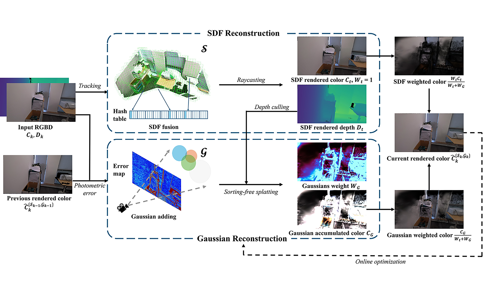
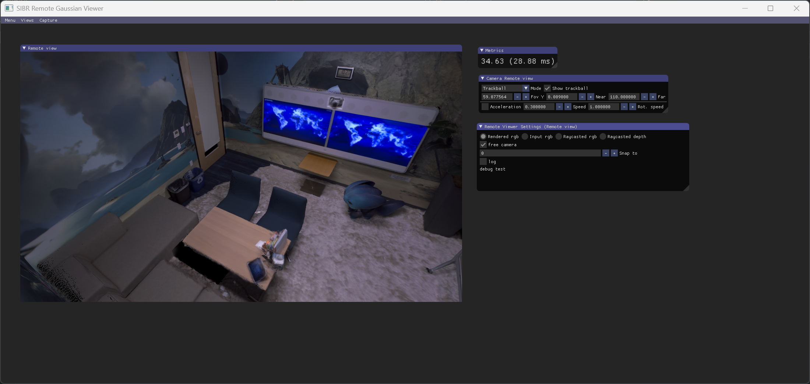

# Gaussian-plus-SDF SLAM: High-fidelity 3D Reconstruction at 150+ fps
Zhexi Peng, Kun Zhou, Tianjia Shao


This repository contains the official authors implementation associated with the paper "Gaussian-plus-SDF SLAM: High-fidelity 3D Reconstruction at 150+ fps", which can be found [here](https://arxiv.org/abs/2509.11574).

Abstract: *While recent Gaussian-based SLAM methods achieve photorealistic reconstruction from RGB-D data, their computational performance remains a critical bottleneck. State-of-the-art techniques operate at less than 20 fps, significantly lagging behind geometry-based approaches like KinectFusion (hundreds of fps). This limitation stems from the heavy computational burden: modeling scenes requires numerous Gaussians and complex iterative optimization to fit RGB-D data; insufficient Gaussian counts or optimization iterations cause severe quality degradation. To address this, we propose a Gaussian-SDF hybrid representation, combining a colorized signed distance field (SDF) for smooth geometry and appearance with 3D Gaussians to capture underrepresented details. The SDF is efficiently constructed via RGB-D fusion (as in geometry-based methods), while Gaussians undergo iterative optimization. 
Our representation enables significant Gaussian reduction (50\% fewer) by avoiding full-scene Gaussian modeling, and efficient Gaussian optimization (75\% fewer iterations) through targeted appearance refinement.
Building upon this representation, we develop GPS-SLAM (Gaussian-plus-SDF SLAM), a real-time 3D reconstruction system achieving over 150 fps on real-world Azure Kinect sequences, faster by an order-of-magnitude than state-of-the-art techniques while maintaining comparable reconstruction quality.*


## News
**[2025.10.18]** We prepare to release the code. We apologize that some features are not yet ready, mainly including online visualization tools and stable multithread running. However, the current version is sufficient to support the conclusions in our paper and to reproduce the experimental results. We will continue to improve GPS-SLAM in the future.

## Todo List
- [ ] Online SLAM viewer
- [ ] Multiprocess trainer


## 1. Installation
We tested on a computer (AMD Ryzen 9 9950X3D + NVIDIA GeForce RTX 4090) with Ubuntu 24.04, cuda 12.8 and gcc 11.4.0. Please note that both the CPU and GPU affect system performance, especially some server CPUs which may cause significant performance degradation.
### 1.1 Clone the Repository
```
git clone --recursive https://github.com/MisEty/GPS-SLAM.git
```

### 1.2 Install the ThirdLibs
You should first download ThirdLibs.zip ([BaiduNetDisk](https://pan.baidu.com/s/1zkN2GSNSQdArECPC1x_cWQ?pwd=2hei) or [GoogleDrive](https://drive.google.com/file/d/1yD0wK8tX4FMos8Fk6-AIxeLdZ5AVuwCO/view?usp=sharing)) and extract it to the project directory; it contains most of the third-party libraries.
```
|-- GES-SLAM
    |-- src
    |-- ThirdLibs
        |-- assimp
        |-- freetype
        |-- indicators
        |-- ...
    |-- ...
```
Run `build_third_libs.sh` to install the third-party libraries. If you encounter any issues, you can install the library by following its official tutorial.
```
bash build_third_libs.sh
```
### 1.3 Build
Run the following command to compile the main program.
```
mkdir -p build && cd build
cmake ..
make -j64
```

## 2. Dataset Preparation
### 2.1 Directory structure
All the datasets should be placed in the `data` folder. 
```
|-- GES-SLAM
    |-- data
        |-- replica
            |-- office0
            |-- ...
        |-- gps_slam
            |-- activity_room
            |-- ...
```

### 2.2 Replica
Download the raw Replica data as below.
```
bash download_replica.sh
```
We use a custom data format for reading. Therefore, we also provide a Python script `scripts/replica_preprocess.py` to convert the raw Replica data into ours data format. You only need to slightly modify the input/output paths in the script to use it.

### 2.3 GPS_SLAM Indoor
GPS_SLAM Indoor is a dataset we created using the Kinect Azure camera. It is used in the experimental section of the paper and includes five indoor scenes. The dataset can be downloaded from [BaiduNetDisk](https://pan.baidu.com/s/1YHZn6B781D9ZtFsf0fi9sw?pwd=5964) or [GoogleDrive](https://drive.google.com/file/d/1ZVICqHVdWDO1OvltxGJXuJ2YG4FYNLHD/view?usp=sharing)

## 3. Run and Evaluation
### 3.1 Run
Our program uses a YAML file for configuration. A simple example of running it is as follows.
```
./build/slam_trainer configs/release/replica/office0.yaml
```
Almost all parameters can be configured through the YAML file. You can find the function corresponding to each YAML parameter by searching through the code. Here, we only list some commonly used experiment-related parameters.
- `workspace_dir`: output path. For each experiment, the corresponding path will be created and cleared to output the experiment results.
- `dev_id`: visible GPUs.
- `work_mode`: `train` for both Gaussian and SDF reconstruction. `recon` for only SDF reconstruction. `eval` for load existing model and evaluation.
- `READER/input_dir`: input dataset path.
- `PIPE/log_slam_state`: record some SLAM-related information during running, mainly for debug and online process visualization.
- `PIPE/eval_after_train`: Immediately render images from all input vies upon completing the scanning.
- `PIPE/save_after_train`: Save the Gaussian models.
- `TSDF/saved_mesh`: Save the extracted mesh from SDF.
- `TSDF/saved_engine`: Save the SDF model.
- `TSDF/use_gt_pose`: Use input poses instead of online tracking.
### 3.2 Evaluation
We referred to 3DGS for the image metric evaluation scripts `scripts/metric_general.py`, RTG-SLAM for the geometric metric evaluation scripts `scripts/geo_general.py`, and TUM-RGBD for the pose trajectory evaluation scripts `scripts/ate_general.py`.
```
python scripts/metric_general.py --gt_path data/replica/office0 --render_path output/release/replica/office0/val/render
python scripts/ate_general.py --gt_path data/replica/office0/camera --est_path output/release/replica/office0/val/pose
python scripts/geo_general.py --gt_mesh data/cull_replica_mesh/office0.ply --recon_mesh output/release/replica/office0/tsdf_mesh.ply --transform data/replica/office0/camera/pose000000.txt
```
We also provide scripts to batch execute the running and evaluation of multiple scenes; you just need to run:
```
bash run/run.sh
```
All the results including FPS, GPU costs, PSNR, SSIM, LPIPS will be logged. Please note that since this is currently a single-threaded version, we have separately listed the SDF Fusion FPS and the Gaussian reconstruction FPS. The theoretical system FPS should be the slower one between the two.

## 4. Visualization

We have built a network-based remote visualization system based on [3DGS](https://github.com/graphdeco-inria/gaussian-splatting) viewer. We provide pre-built binaries for Windows [here](https://drive.google.com/file/d/1h_6quYAqQBvbxLS1L9ZfF5MIkEpDbYVi/view?usp=sharing). Or you can clone our [source code](https://github.com/MisEty/GPS-SLAM_viewer) and compile it.
```
mkdir build
cd build
cmake ..
cmake --build build --target install --config RelWithDebInfo
```
If you encounter any issues during compilation, please refer to [3DGS](https://github.com/graphdeco-inria/gaussian-splatting) for help. Then, you need to load the model and launch the rendering engine as the server within the GPS-SLAM project. We provide a sample configuration file as a reference.
```
./build/remote_viewer configs/viewer/office0.yaml
```
Finally, start the visualization program under the viewer project as the client.

```
./install/bin/SIBR_remoteGaussian_app_rwdi.exe -s ./install/resources/init_data --ip {ip}  --port {port}
```
The `-s` directory must contain a valid `cameras.json` file. You can use the file from the output `gs_model` path, which contains the viewpoints of all SLAM input cameras. The `-ip` is the IP address of the server, and the port is set in the server's configuration file.

<section class="section" id="BibTeX">
  <div class="container is-max-desktop content">
    <h2 class="title">BibTeX</h2>
    <pre><code>@misc{peng2025gpsslam,
      title={Gaussian-Plus-SDF SLAM: High-fidelity 3D Reconstruction at 150+ fps}, 
      author={Zhexi Peng and Kun Zhou and Tianjia Shao},
      year={2025},
      eprint={2509.11574},
      archivePrefix={arXiv},
      primaryClass={cs.CV},
      url={https://arxiv.org/abs/2509.11574}, 
      }</code></pre>
  </div>
</section>

## Acknowledgments
This project is built upon [3DGS](https://github.com/graphdeco-inria/gaussian-splatting), [gsplat](https://github.com/nerfstudio-project/gsplat) and [InfiniTAM](https://github.com/victorprad/InfiniTAM). If you find our code and paper useful, please also cite these outstanding works.
